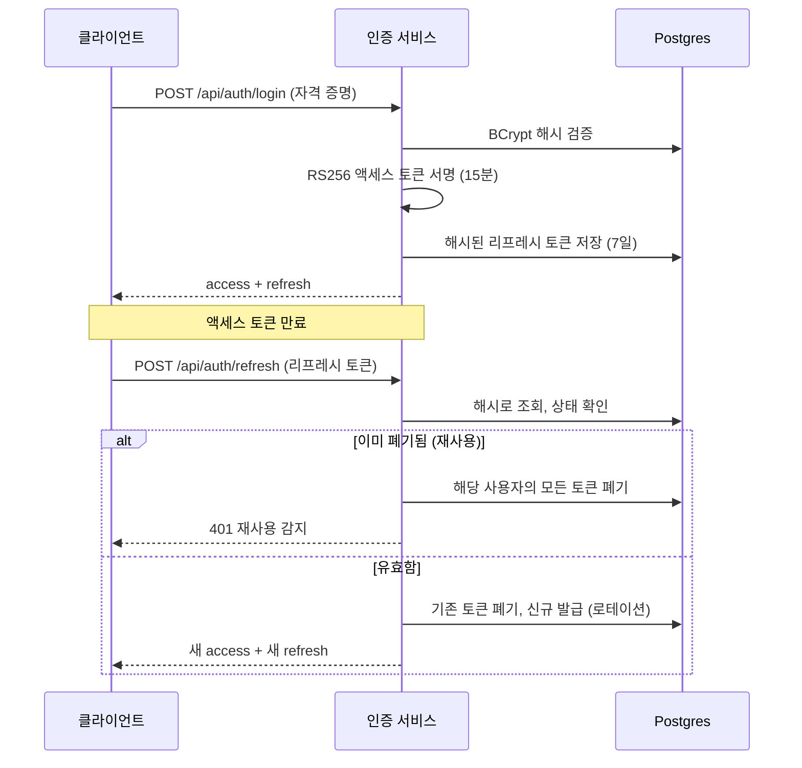

> 🇺🇸 English version: [`README.md`](README.md)
# OAuth2 / JWT 인증 서비스

**Spring Boot 3**와 **Spring Security 6**로 구축한 실무형 인증·인가 서비스 — RS256 서명 JWT 액세스 토큰, 탈취 감지를 포함한 리프레시 토큰 로테이션, 역할 기반 접근 제어(RBAC), 그리고 레이트 리밋이 적용된 인증 엔드포인트를 제공합니다.


---

## 이 프로젝트가 보여주는 것

- **상태 비저장(stateless) 토큰 기반 인증** — JWT 라이브러리를 덧붙이는 대신 Spring Security가 기본 제공하는 OAuth2 리소스 서버(`JwtEncoder` / `JwtDecoder`), 즉 프레임워크의 실제 프리미티브를 사용합니다.
- **비대칭 서명(RS256)** — 토큰 발급과 검증을 깔끔하게 분리합니다. 검증 측은 공개키만 있으면 됩니다.
- **재사용 감지를 포함한 리프레시 토큰 로테이션** — 대부분의 습작용 인증 프로젝트가 건너뛰지만, 핀테크에서는 반드시 필요한 보안 통제입니다.
- **리소스 서버 단에서 강제되는 RBAC** — `USER`와 `ADMIN` 경계가 실제로 동작합니다.
- **인증 표면(credential surface) 방어** — `/api/auth/**`에 대한 IP별 레이트 리밋, BCrypt 비밀번호 해싱, 해시 형태로만 저장되는 불투명(opaque) 리프레시 토큰.
- **코드로 관리되는 스키마** — Flyway 마이그레이션, 컨테이너화된 Postgres, OpenAPI/Swagger 문서.

핀테크 백엔드 요구사항을 염두에 두고 설계했습니다: 파트너를 향한 안전한 토큰 발급, 분산 서비스에 적합한 상태 비저장 검증, 그리고 마이그레이션 기반의 감사 가능한 스키마.

---

## 아키텍처

```
Client ──▶ RateLimitingFilter ──▶ AuthController ──▶ AuthService
                                                          │
                        ┌─────────────────────────────────┼───────────────────────┐
                        ▼                                  ▼                       ▼
                  JwtService                    RefreshTokenService          UserRepository
              (RS256 액세스 토큰)          (로테이션 / 폐기 / 재사용 감지)      (BCrypt 사용자)
                        │                                  │
                        ▼                                  ▼
                  JwtEncoder                    refresh_tokens (Postgres, 해시 저장)

보호된 요청 ──▶ oauth2ResourceServer(jwt) ──▶ JwtDecoder (공개키) ──▶ @EnableMethodSecurity / RBAC
```

### 토큰 흐름



| 컴포넌트 | 책임 |
|---|---|
| `SecurityConfig` | 상태 비저장 필터 체인, 리소스 서버 JWT 검증, RBAC 규칙, 클레임→권한 매핑 |
| `JwtConfig` | RSA 키페어 및 `JwtEncoder` / `JwtDecoder` 빈 |
| `JwtService` | `roles` / `uid` 클레임을 담은 단기 RS256 액세스 토큰 발급 |
| `RefreshTokenService` | 불투명 토큰 생성, 로테이션, 폐기, 재사용 감지 |
| `RateLimitingFilter` | 인증 엔드포인트에 대한 IP별 토큰 버킷 스로틀링 |
| `AuthService` | register / login / refresh / logout 오케스트레이션 |

---

## 보안 설계 결정

코드 이면의 의도적인 선택들 — "무엇"이 아니라 "왜"에 대한 기록입니다.

**HS256이 아닌 RS256.** 액세스 토큰은 RSA 개인키로 서명하고 공개키로 검증합니다. 이는 다수의 리소스 서버가 서명 키를 보유하지 않은 채 토큰을 검증해야 하는 실제 OAuth2 배포 형태를 반영합니다. 프로덕션이라면 키페어는 KMS/시크릿 매니저에서 공급받아 주기적으로 교체하고, 공개키는 JWKS 엔드포인트로 노출할 것입니다.

**리프레시 토큰은 불투명하며 해시로 저장됩니다.** 리프레시 토큰은 JWT가 아니라 고엔트로피 랜덤 바이트입니다. SHA-256 해시만 저장하므로 DB가 유출되어도 사용 가능한 토큰은 노출되지 않습니다. 액세스 토큰은 짧게(15분) 유지해 베어러 토큰 유출의 피해 범위를 제한하고, 더 긴 세션(7일)은 리프레시 토큰이 담당합니다.

**재사용 감지를 동반한 로테이션.** 모든 리프레시는 1회용입니다. 유효한 토큰을 제시하면 그 토큰은 폐기되고 새 토큰 쌍이 발급됩니다. *이미 폐기된* 토큰이 제시되면 정상 클라이언트가 이미 로테이션을 마쳤다는 뜻이므로 탈취의 강한 신호로 보고, 해당 사용자의 모든 활성 토큰을 방어적으로 폐기합니다.

**리소스 서버에서의 RBAC.** 역할은 `roles` 클레임에 실려 `ROLE_` 접두사 권한으로 매핑되며, URL 규칙과 `@EnableMethodSecurity` 양쪽에서 강제됩니다. 인가 판단이 서버 측 세션 상태가 아니라 검증된 토큰에서 이루어집니다.

**인증 요청 레이트 리밋.** IP별 토큰 버킷이 `/api/auth/**`를 제한해 크리덴셜 스터핑과 무차별 대입 공격을 무디게 만듭니다. (여기서는 인메모리 방식이며, 확장된 배포에서는 Redis로 뒷받침해야 합니다.)

---

## 기술 스택

Java 17 · Spring Boot 3.2 · Spring Security 6 (OAuth2 Resource Server) · Spring Data JPA · PostgreSQL 16 · Flyway · Nimbus JOSE · springdoc-openapi · JUnit 5 · Docker Compose

---

## 빠른 시작

**사전 요구사항:** JDK 17+, Docker(Postgres 용), Maven 3.9+.

```bash
# 1. Postgres 시작
docker compose up -d

# 2. 서비스 실행 (부팅 시 Flyway가 스키마를 적용)
mvn spring-boot:run
```

API는 `http://localhost:8080`에서 뜨며, 인터랙티브 문서는 **`http://localhost:8080/swagger-ui.html`** 에 있습니다.
최초 실행 시 데모 관리자 계정이 시드됩니다: `admin` / `Admin@12345` (`APP_SEED_ADMIN=false`로 끌 수 있습니다).

---

## API 레퍼런스

| 메서드 | 엔드포인트 | 인증 | 설명 |
|---|---|---|---|
| `POST` | `/api/auth/register` | 공개 | 사용자 생성 후 토큰 쌍 발급 |
| `POST` | `/api/auth/login` | 공개 | 자격 증명을 토큰 쌍으로 교환 |
| `POST` | `/api/auth/refresh` | 공개 | 리프레시 토큰을 로테이션해 새 토큰 쌍 발급 |
| `POST` | `/api/auth/logout` | 공개 | 리프레시 토큰 폐기 |
| `GET`  | `/api/me` | Bearer | 현재 사용자 프로필 |
| `GET`  | `/api/admin/overview` | Bearer + `ADMIN` | 역할 제한 리소스 |

### 실습 예시

```bash
# 회원가입 (access + refresh 토큰 반환)
curl -s -X POST http://localhost:8080/api/auth/register \
  -H 'Content-Type: application/json' \
  -d '{"username":"nadia","email":"nadia@example.com","password":"S3curePass!"}'

# 보호된 엔드포인트 호출
curl -s http://localhost:8080/api/me \
  -H "Authorization: Bearer <ACCESS_TOKEN>"

# 토큰 로테이션 (기존 리프레시 토큰은 즉시 무효화)
curl -s -X POST http://localhost:8080/api/auth/refresh \
  -H 'Content-Type: application/json' \
  -d '{"refreshToken":"<REFRESH_TOKEN>"}'

# 관리자 전용 (일반 USER는 403, 시드된 admin은 200)
curl -s http://localhost:8080/api/admin/overview \
  -H "Authorization: Bearer <ADMIN_ACCESS_TOKEN>"
```

---

## 프로젝트 구조

```
src/main/java/com/portfolio/auth
├── config/        SecurityConfig, JwtConfig, OpenApiConfig, DataSeeder
├── controller/    AuthController, ResourceController
├── dto/           요청/응답 record (검증 포함)
├── entity/        User, Role, RefreshToken
├── repository/    Spring Data JPA 리포지토리
├── security/      JwtService, CustomUserDetailsService, RateLimitingFilter
├── service/       AuthService, RefreshTokenService
└── exception/     GlobalExceptionHandler, AuthException, ApiError
src/main/resources/db/migration   Flyway 스키마 (V1__init.sql)
src/test/...                      JwtServiceTest (서명 + 클레임)
```

---

## 테스트

```bash
mvn test
```

`JwtServiceTest`는 실제 RS256 토큰을 발급한 뒤 공개키로 서명과 클레임을 검증합니다 — Spring 컨텍스트나 데이터베이스가 필요 없습니다.

---

## 로드맵 — 프로덕션 하드닝

이번 포트폴리오 빌드에서는 의도적으로 범위 밖에 두었지만, 솔직한 "다음 단계"로 남겨 둡니다:

- `spring-security-oauth2-client`를 통한 소셜 / 서드파티 로그인 (Google, GitHub)
- JWKS 엔드포인트 + 스케줄 기반 키 로테이션, KMS에서 키 공급
- Redis 기반 레이트 리밋과 즉시 폐기를 위한 짧은 TTL의 액세스 토큰 거부 목록(denylist)
- 이메일 인증 및 비밀번호 재설정 플로우
- 로테이션 / 재사용 감지 전체 경로를 커버하는 Testcontainers 통합 테스트
- 인증 이벤트에 대한 구조화된 감사 로깅과 메트릭 (Micrometer)

---

## 라이선스

MIT — [`LICENSE`](LICENSE) 참고.
