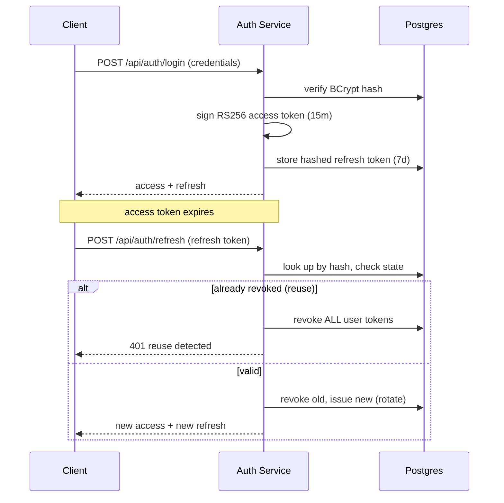

README.md → > 🇰🇷 한국어 버전: [README.ko.md](README.ko.md)
# OAuth2 / JWT Authentication Service
A production-shaped authentication and authorization service built with **Spring Boot 3** and **Spring Security 6** — RS256-signed JWT access tokens, rotating refresh tokens with theft detection, role-based access control, and rate-limited credential endpoints.


---

## What this project demonstrates

- **Stateless, token-based auth** using Spring Security's *native* OAuth2 resource server (`JwtEncoder` / `JwtDecoder`) rather than a bolted-on JWT library — the framework's real primitives.
- **Asymmetric signing (RS256)** so token issuance and verification are cleanly separable — verifiers only ever need the public key.
- **Refresh-token rotation with reuse detection** — the security control most toy auth projects skip, and the one that matters for fintech.
- **Role-based access control** enforced at the resource server, with a working `USER` vs `ADMIN` boundary.
- **Defense on the credential surface** — per-IP rate limiting on `/api/auth/**`, BCrypt password hashing, opaque refresh tokens stored only as hashes.
- **Schema as code** with Flyway migrations, containerized Postgres, and OpenAPI/Swagger docs.

Built with fintech backend requirements in mind: secure partner-facing token issuance, stateless verification suited to distributed services, and an auditable, migration-driven schema.

---

## Architecture

```
Client ──▶ RateLimitingFilter ──▶ AuthController ──▶ AuthService
                                                          │
                        ┌─────────────────────────────────┼───────────────────────┐
                        ▼                                  ▼                       ▼
                  JwtService                    RefreshTokenService          UserRepository
              (RS256 access token)        (rotate / revoke / detect reuse)   (BCrypt users)
                        │                                  │
                        ▼                                  ▼
                  JwtEncoder                         refresh_tokens (Postgres, hashed)

Protected requests ──▶ oauth2ResourceServer(jwt) ──▶ JwtDecoder (public key) ──▶ @EnableMethodSecurity / RBAC
```

### Token flow



| Component | Responsibility |
|---|---|
| `SecurityConfig` | Stateless filter chain, resource-server JWT validation, RBAC rules, claim→authority mapping |
| `JwtConfig` | RSA keypair + `JwtEncoder` / `JwtDecoder` beans |
| `JwtService` | Issues short-lived RS256 access tokens with `roles` / `uid` claims |
| `RefreshTokenService` | Opaque token generation, rotation, revocation, reuse detection |
| `RateLimitingFilter` | Per-IP token-bucket throttle on credential endpoints |
| `AuthService` | Orchestrates register / login / refresh / logout |

---

## Security design decisions

These are the deliberate choices behind the code — the "why", not just the "what".

**RS256 over HS256.** Access tokens are signed with an RSA private key and verified with the public key. This mirrors real OAuth2 deployments where many resource servers must validate tokens without holding signing material. In production the keypair would come from a KMS / secrets manager and be rotated, with the public key exposed via a JWKS endpoint.

**Refresh tokens are opaque and stored hashed.** The refresh token is high-entropy random bytes, not a JWT. Only its SHA-256 hash is persisted, so a database leak never exposes a usable token. Access tokens stay short-lived (15 min) to bound the blast radius of a leaked bearer token; refresh tokens carry the longer-lived session (7 days).

**Rotation with reuse detection.** Each refresh is single-use: presenting a valid token revokes it and issues a fresh pair. If an *already-revoked* token is presented, that signals the legitimate client already rotated it — a strong indicator of theft — so every active token for that user is revoked defensively.

**RBAC at the resource server.** Roles ride in a `roles` claim, mapped to `ROLE_`-prefixed authorities and enforced both by URL rules and `@EnableMethodSecurity`, so authorization decisions are made from the verified token, not from server-side session state.

**Rate-limited credentials.** A per-IP token bucket throttles `/api/auth/**` to blunt credential stuffing and brute force. (In-memory here; a scaled deployment would back this with Redis.)

---

## Tech stack

Java 17 · Spring Boot 3.2 · Spring Security 6 (OAuth2 Resource Server) · Spring Data JPA · PostgreSQL 16 · Flyway · Nimbus JOSE · springdoc-openapi · JUnit 5 · Docker Compose

---

## Quickstart

**Prerequisites:** JDK 17+, Docker (for Postgres), and Maven 3.9+.

```bash
# 1. Start Postgres
docker compose up -d

# 2. Run the service (Flyway applies the schema on boot)
mvn spring-boot:run
```

The API comes up at `http://localhost:8080`, with interactive docs at **`http://localhost:8080/swagger-ui.html`**.
A demo admin account is seeded on first run: `admin` / `Admin@12345` (toggle with `APP_SEED_ADMIN=false`).

---

## API reference

| Method | Endpoint | Auth | Description |
|---|---|---|---|
| `POST` | `/api/auth/register` | Public | Create a user, receive a token pair |
| `POST` | `/api/auth/login` | Public | Exchange credentials for a token pair |
| `POST` | `/api/auth/refresh` | Public | Rotate the refresh token for a new pair |
| `POST` | `/api/auth/logout` | Public | Revoke a refresh token |
| `GET`  | `/api/me` | Bearer | Current user's profile |
| `GET`  | `/api/admin/overview` | Bearer + `ADMIN` | Role-restricted resource |

### Walkthrough

```bash
# Register (returns access + refresh tokens)
curl -s -X POST http://localhost:8080/api/auth/register \
  -H 'Content-Type: application/json' \
  -d '{"username":"nadia","email":"nadia@example.com","password":"S3curePass!"}'

# Call a protected endpoint
curl -s http://localhost:8080/api/me \
  -H "Authorization: Bearer <ACCESS_TOKEN>"

# Rotate tokens (the old refresh token is now invalid)
curl -s -X POST http://localhost:8080/api/auth/refresh \
  -H 'Content-Type: application/json' \
  -d '{"refreshToken":"<REFRESH_TOKEN>"}'

# Admin-only (403 for a normal USER, 200 for the seeded admin)
curl -s http://localhost:8080/api/admin/overview \
  -H "Authorization: Bearer <ADMIN_ACCESS_TOKEN>"
```

---

## Project structure

```
src/main/java/com/portfolio/auth
├── config/        SecurityConfig, JwtConfig, OpenApiConfig, DataSeeder
├── controller/    AuthController, ResourceController
├── dto/           request/response records (validated)
├── entity/        User, Role, RefreshToken
├── repository/    Spring Data JPA repositories
├── security/      JwtService, CustomUserDetailsService, RateLimitingFilter
├── service/       AuthService, RefreshTokenService
└── exception/     GlobalExceptionHandler, AuthException, ApiError
src/main/resources/db/migration   Flyway schema (V1__init.sql)
src/test/...                      JwtServiceTest (signature + claims)
```

---

## Testing

```bash
mvn test
```

`JwtServiceTest` issues a real RS256 token and validates its signature and claims against the public key — no Spring context or database required.

---

## Roadmap — production hardening

Deliberately out of scope for this portfolio build, documented as the honest "what's next":

- Social / third-party login (Google, GitHub) via `spring-security-oauth2-client`
- JWKS endpoint + scheduled key rotation, keys sourced from a KMS
- Redis-backed rate limiting and a short-TTL access-token denylist for immediate revocation
- Email verification and password-reset flows
- Testcontainers-based integration tests covering the full rotation / reuse-detection path
- Structured audit logging and metrics (Micrometer) on auth events

---

## License

MIT — see [`LICENSE`](LICENSE).
